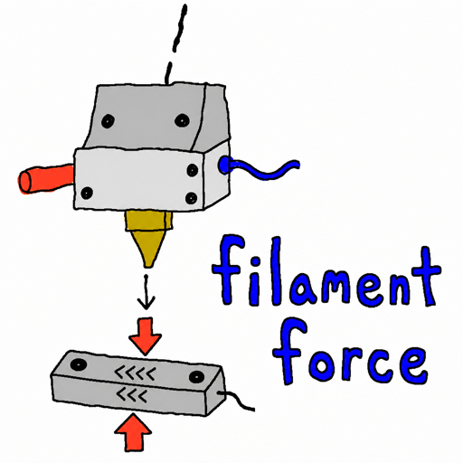

<p align="center">
  
</p>

# filament_force

Pauses the print on filament runout or a jam, using the toolhead load cell.

Needs `[load_cell_probe]` or `[load_cell]` (Kalico or Klipper).

## Install

```sh
cd ~
git clone https://github.com/charliemayall/klipper-filament-force.git
cd klipper-filament-force
./install.sh [~/klipper]
```

Pass a Kalico tree if that is not `~/klipper`. The script can copy
`filament_force.cfg` into `printer_data/config`. Then add:

```ini
[include filament_force.cfg]
```

Restart Klipper.

Moonraker update manager:

```ini
[update_manager filament_force]
type: git_repo
path: ~/klipper-filament-force
origin: https://github.com/charliemayall/klipper-filament-force.git
primary_branch: main
managed_services: klipper
is_system_service: False
post_update_script: install.sh
```

## First use

1. Load filament.
2. `FILAMENT_FORCE_CAL_OH_SHIT` - cools the hotend, then pushes into the
   cold nozzle to set the jam stop. Do not run this during a print.
3. `SAVE_CONFIG` - writes `oh_shit_force` into `printer.cfg`. If that
   option is in `filament_force.cfg`, delete it or SAVE_CONFIG will refuse.
4. Optional: `FILAMENT_FORCE_TEST_RUNOUT RETRACT=30 TEMP=220` should report
   a runout in the console.

Detection is on. `FILAMENT_FORCE_SET ENABLE=0` turns it off.

On a trip: fix the filament, then `RESUME`. If nothing was wrong:
`FILAMENT_FORCE_RESET` then `RESUME`.

## Toolchanger

Call two hooks from your park and pickup macros. The extra does not patch
them.

- `FILAMENT_FORCE_SUPPRESS_BEGIN` before park or pickup motion (stops scoring)
- `FILAMENT_FORCE_SUPPRESS_END TOOL={t}` after a successful pickup (records the tool, scoring on)
- `FILAMENT_FORCE_SUPPRESS_END` with no `TOOL` after a park that leaves the head empty

A single-tool printer can ignore this.

### INDX

In `CHANGE_TOOL`, inside ``, before `PARK_TOOL` /
`_PICKUP_TOOL`:

```gcode
FILAMENT_FORCE_SUPPRESS_BEGIN
```

Last line of `_RECORD_TOOLCHANGE`:

```gcode
FILAMENT_FORCE_SUPPRESS_END TOOL={t}
```

Standalone `PARK_TOOL` (calibration, `TC_CYCLE_ALL`) also needs a begin and
an end. Put `FILAMENT_FORCE_SUPPRESS_BEGIN` at the start of `PARK_TOOL` (nested begin from
`CHANGE_TOOL` is fine). Do not put `FILAMENT_FORCE_SUPPRESS_END` inside `PARK_TOOL` -
`CHANGE_TOOL` would then score the pickup latch. After those standalone
parks:

```gcode
PARK_TOOL
FILAMENT_FORCE_SUPPRESS_END
```

## Resume

If your `RESUME` wrapper does extra work:

```gcode

    FILAMENT_FORCE_RESUME

```

## Spike check

Continuous scoring watches forward extrusion. The spike check is separate:
a one-shot retract/deretract that asks whether filament is still in the
melt zone. It never pauses the print.

The sequence is retract 3 mm, sample Force1, then deretract 3.2 mm (the
retract plus 0.2 mm extra prime) while tracking the load cell. Filament in
the melt zone resists that push, so the force jumps. An empty hotend does
not.

The probe scores `max(|peak - Force1|, |Force2 - Force1|)`. Peak is the
largest excursion during the deretract; Force2 is the sample at the end.
If that delta is at least `probe_spike_g` (default 50 g), filament is
present. The result is `printer.filament_force.last_probe_spike` (1 or 0)
and `last_probe_delta_g`.

Call it when you need a yes/no on filament in the melt zone, not while
the print is extruding. After a tool pickup is the usual spot: the docked
tool may be empty, and a purge into a dry hotend is a mess. Run it after
`FILAMENT_FORCE_SUPPRESS_END` (pickup finished), before the purge. Same
idea before a manual load, or a resume that purges.

The nozzle needs to be at print temperature; this moves the extruder.
Jinja in the same macro is expanded before any G-code runs, so read the
result from a follow-up macro:

```gcode
FILAMENT_FORCE_CHECK_SPIKE
```

Then, in a later macro (not the same template):

```gcode

    {action_respond_info("No filament spike - abort purge")}

```

Override the motion with `SPIKE_G=`, `RETRACT=`, `EXTRA_PRIME=`,
`FEEDRATE=` on the command, or `FILAMENT_FORCE_SET PROBE_SPIKE_G=` /
`PROBE_RETRACT_MM=` / `PROBE_EXTRA_PRIME_MM=` / `PROBE_FEEDRATE=`.
Skipped with `probe_busy` if a probe, trip, or cal is already running.

## Commands

- `FILAMENT_FORCE_SET ENABLE=0|1` - turn detection on or off
- `FILAMENT_FORCE_CAL_OH_SHIT` - set the jam stop from a cold extrude; `SAVE_CONFIG` to keep it
- `FILAMENT_FORCE_TEST_RUNOUT RETRACT=<mm> TEMP=<c>` - should report a runout
- `FILAMENT_FORCE_CHECK_SPIKE` - one-shot presence check
- `FILAMENT_FORCE_QUERY` - current state
- `FILAMENT_FORCE_SET_TOOL TOOL=n`
- `FILAMENT_FORCE_RESET [TOOL=n]` - clear history after a false trip
- `FILAMENT_FORCE_RESUME [VELOCITY=v]`
- `FILAMENT_FORCE_SUPPRESS ENABLE=0|1`
- `FILAMENT_FORCE_SUPPRESS_BEGIN` - call before park or pickup
- `FILAMENT_FORCE_SUPPRESS_END [TOOL=n]` - call after pickup, or after a park with no TOOL

## Development

```sh
uv sync
uv run pytest
uv run ty check src tests
```
